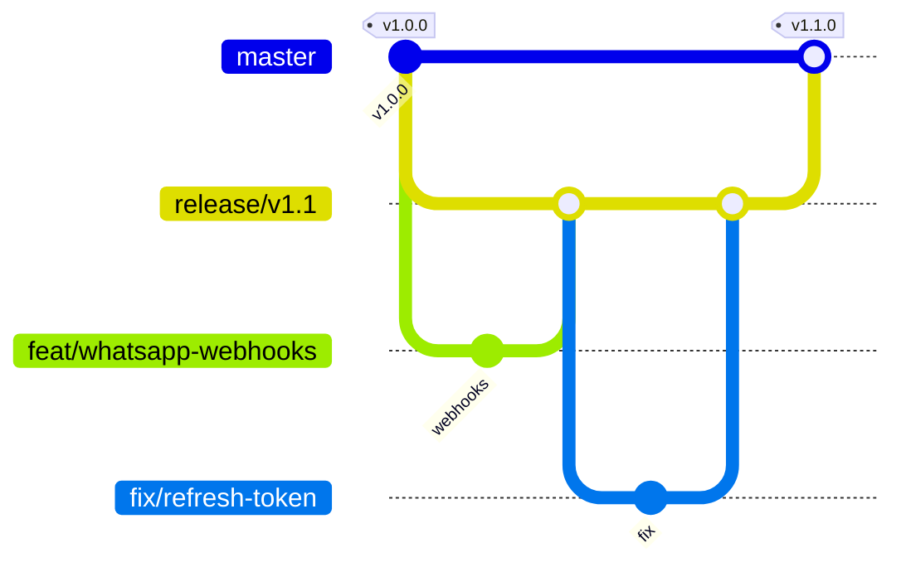

# Contribuindo com o Zettabytes

Obrigado pelo interesse! Este guia explica como o projeto é versionado, como preparar o ambiente e o que esperamos de um pull request.

Ao participar, você concorda em seguir o [Código de Conduta](CODE_OF_CONDUCT.md). Toda contribuição é licenciada sob a [licença MIT](LICENSE) do projeto.

## Sumário

- [Formas de contribuir](#formas-de-contribuir)
- [Modelo de versões e branches](#modelo-de-versões-e-branches)
- [Fluxo de trabalho](#fluxo-de-trabalho)
- [Padrão de commits](#padrão-de-commits)
- [Checklist do pull request](#checklist-do-pull-request)
- [Padrões de código](#padrões-de-código)
- [Publicando uma versão (mantenedores)](#publicando-uma-versão-mantenedores)

## Formas de contribuir

- **Reportar bugs**: abra uma issue com o template *Bug report*.
- **Sugerir funcionalidades**: use o template *Feature request* e descreva o problema antes da solução.
- **Implementar itens do roadmap**: veja a seção [Roadmap](README.md#roadmap) do README e as issues com os rótulos `good first issue` e `help wanted`.
- **Documentação**: correções no README, em `docs/` e nos docstrings são sempre bem-vindas.
- **Segurança**: vulnerabilidades **não** vão em issues públicas. Siga o [SECURITY.md](SECURITY.md).

Para mudanças grandes (novo módulo, nova tabela, troca de biblioteca), abra uma issue de discussão antes de escrever código.

## Modelo de versões e branches

O projeto segue o [Versionamento Semântico](https://semver.org/lang/pt-BR/) (`MAJOR.MINOR.PATCH`) e mantém **uma branch por versão**. A evolução de cada versão acontece na sua própria branch.

| Branch | Papel |
|---|---|
| `master` | Última versão **estável** publicada. Só recebe merges de branches de versão finalizadas. |
| `release/vX.Y` | Branch da versão em desenvolvimento ou em manutenção (ex.: `release/v1.0`, `release/v1.1`, `release/v2.0`). **É o alvo dos PRs.** |
| `feat/…`, `fix/…`, `docs/…`, `refactor/…`, `test/…`, `chore/…` | Branches de trabalho, criadas a partir da branch de versão ativa. |



**Qual versão incrementar?**

| Mudança | Incremento | Exemplo |
|---|---|---|
| Quebra de contrato da API, migração que exige ação manual, remoção de feature | MAJOR | `1.4.2 → 2.0.0` |
| Nova funcionalidade compatível (endpoint, tela, integração) | MINOR | `1.0.0 → 1.1.0` |
| Correção de bug compatível | PATCH | `1.1.0 → 1.1.1` |

A branch de versão ativa é sempre a `release/vX.Y` mais recente. Na dúvida, veja a descrição do repositório ou pergunte na issue.

## Fluxo de trabalho

1. **Fork** o repositório (ou crie uma branch, se você for mantenedor).
2. Parta da branch de versão ativa:

   ```bash
   git fetch origin
   git switch -c feat/minha-funcionalidade origin/release/v1.1
   ```

3. Prepare o ambiente seguindo o [Guia rápido do README](README.md#guia-rápido).
4. Implemente a mudança **com testes**.
5. Rode as verificações locais:

   ```bash
   pnpm lint
   pnpm typecheck
   pnpm test
   ```

6. Registre a mudança em `CHANGELOG.md`, na seção **[Não lançado]**.
7. Abra o PR apontando para a `release/vX.Y` ativa (não para a `master`) e preencha o template.

Mantenha a branch atualizada com `git rebase origin/release/vX.Y` em vez de merges de sincronização.

## Padrão de commits

Usamos [Conventional Commits](https://www.conventionalcommits.org/pt-br/v1.0.0/):

```
<tipo>(<escopo opcional>): <descrição no imperativo>
```

| Tipo | Quando usar |
|---|---|
| `feat` | nova funcionalidade |
| `fix` | correção de bug |
| `docs` | apenas documentação |
| `refactor` | mudança interna sem alterar comportamento |
| `test` | testes novos ou ajustados |
| `perf` | melhoria de desempenho |
| `chore` | build, dependências, configuração |
| `ci` | pipelines de CI |

Escopos sugeridos: `api`, `web`, `api-client`, `db`, `auth`, `whatsapp`, `agents`, `flows`, `billing`, `infra`, `docs`.

Exemplos:

```
feat(whatsapp): adiciona handshake do webhook da Meta
fix(auth): impede reuso de refresh token revogado
docs: explica o modelo de branches por versão
```

Para quebras de compatibilidade, use `!` (`feat(api)!: …`) e descreva o impacto no rodapé `BREAKING CHANGE:`.

## Checklist do pull request

- [ ] O PR aponta para a branch `release/vX.Y` ativa.
- [ ] Tem testes cobrindo o comportamento novo ou o bug corrigido.
- [ ] `pnpm lint`, `pnpm typecheck` e `pnpm test` passam localmente.
- [ ] Mudanças de schema têm migration do Alembic (`pnpm --filter @zettabytes/api db:revision "mensagem"`) revisada à mão.
- [ ] Mudanças na API regeneraram o client (`pnpm codegen`) e o `openapi.json`/`schema.d.ts` foram commitados.
- [ ] Toda consulta a tabela de domínio filtra por `company_id`.
- [ ] Nenhum segredo, `.env` ou dado pessoal foi commitado.
- [ ] `CHANGELOG.md` atualizado.
- [ ] Documentação (README, `docs/ARCHITECTURE.md`) atualizada quando necessário.

## Padrões de código

### Backend (Python)

- Python 3.12+, **tipado** (mypy `strict`), formatado e analisado com **ruff** (linha de 100 colunas).
- Camadas: `api/` (HTTP, validação, dependências) → `services/` (regras de negócio, sem FastAPI) → `models/` (SQLAlchemy). Schemas Pydantic em `schemas/`.
- Commit da transação é explícito, feito no service ou no endpoint, nunca escondido em dependências.
- Tabelas de domínio usam `TenantMixin` (coluna `company_id` indexada). Endpoints de tenant recebem `ctx: Tenant` (ou `TenantAdmin`/`TenantOwner`) e filtram por `ctx.company_id`.
- Enums são `StrEnum` em `app/models/enums.py`, gravados como `VARCHAR`: adicionar valores não exige migration.
- Segredos em repouso usam o `TypeDecorator` de criptografia (Fernet), nunca texto puro.
- Erros de domínio herdam de `DomainError` (`app/core/exceptions.py`).
- Testes de integração rodam contra Postgres real (`zettabytes_test`). Use as fixtures `client`, `db`, `plans` e os helpers `register()` e `auth()` de `tests/conftest.py`.

### Frontend (TypeScript)

- TypeScript `strict`, React Server Components por padrão e `"use client"` apenas quando necessário.
- Chamadas à API somente via `@zettabytes/api-client` (tipado pelo OpenAPI). Não escreva tipos de resposta à mão.
- Formatação com Prettier (`pnpm format`).

### Contrato API ↔ Web

O `openapi.json` gerado pelo FastAPI é a **fonte única da verdade**. Qualquer mudança em schema ou rota exige `pnpm codegen`. Se o contrato quebrar, o `typecheck` do frontend falha, e isso é intencional.

## Publicando uma versão (mantenedores)

1. Na branch `release/vX.Y`, atualize a versão em:
   - `package.json` (raiz) e `apps/*/package.json`, `packages/*/package.json`;
   - `apps/api/pyproject.toml` (e rode `uv lock` em `apps/api`);
   - `apps/api/app/core/config.py` (`VERSION`), seguido de `pnpm codegen`.
2. Mova as entradas de **[Não lançado]** no `CHANGELOG.md` para a nova versão, com data.
3. Faça merge da `release/vX.Y` na `master` e crie a tag anotada:

   ```bash
   git tag -a vX.Y.Z -m "Zettabytes vX.Y.Z"
   git push origin master --tags
   ```

4. Publique a *Release* no GitHub usando o trecho do CHANGELOG.
5. Crie a branch da próxima versão a partir da `master` (ex.: `release/v1.2`) e defina-a como alvo padrão dos PRs.

Correções em versões antigas ainda suportadas são feitas na `release/vX.Y` correspondente e publicadas como PATCH.
