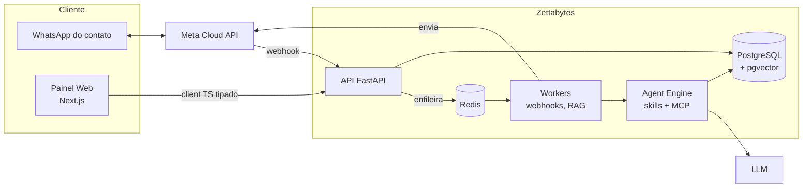

<div align="center">

# Zettabytes

**Plataforma open source de automação de WhatsApp com fluxos visuais e agentes de IA generativa.**

Multi-tenant, no modelo **Meta Tech Provider**: cada cliente conecta a própria WABA e paga as conversas direto à Meta.

[](CHANGELOG.md)
[](LICENSE)
[](https://github.com/licodevone/Zettabytes/actions/workflows/ci.yml)
[](CONTRIBUTING.md)


[Guia rápido](#guia-rápido) · [Arquitetura](docs/ARCHITECTURE.md) · [Roadmap](#roadmap) · [Contribuir](CONTRIBUTING.md) · [Changelog](CHANGELOG.md)

</div>

---

## Sumário

- [Visão geral](#visão-geral)
- [Status da versão 1.0](#status-da-versão-10)
- [Stack](#stack)
- [Arquitetura em 1 minuto](#arquitetura-em-1-minuto)
- [Guia rápido](#guia-rápido)
- [Variáveis de ambiente](#variáveis-de-ambiente)
- [Comandos](#comandos)
- [Estrutura do repositório](#estrutura-do-repositório)
- [API](#api)
- [Implementando uma nova funcionalidade](#implementando-uma-nova-funcionalidade)
- [Testes e qualidade](#testes-e-qualidade)
- [Versões e branches](#versões-e-branches)
- [Roadmap](#roadmap)
- [Contribuindo](#contribuindo)
- [Segurança](#segurança)
- [Licença](#licença)

## Visão geral

O Zettabytes é uma base SaaS para empresas atenderem clientes no WhatsApp combinando três formas de conversa:

| Modo | Como funciona |
|---|---|
| **Fluxos** | Automação determinística desenhada num canvas visual (menus, perguntas, condições, delays). |
| **Agentes de IA** | Personas (vendas, suporte, agendamento…) com RAG sobre a base de conhecimento do cliente, memória e tools/MCP. |
| **Humano** | Live Chat com transbordo automático quando a IA não resolve, com fila, atribuição e janela de 24h. |

Princípios do projeto:

- **Multi-tenant desde o primeiro dia**: todo dado de domínio carrega `company_id`, pronto para Row-Level Security.
- **Contrato único**: o OpenAPI do FastAPI gera os tipos TypeScript do frontend. Se o backend quebrar o contrato, o build do frontend falha.
- **Segurança por padrão**: Argon2, JWT com rotação de refresh token, segredos criptografados em repouso e validação de configuração no boot em produção.
- **Custo previsível de IA**: cotas mensais por plano com contador atômico. Ao estourar, a IA pausa e os fluxos continuam funcionando.

## Status da versão 1.0

A **v1.0.0** entrega a **fundação** do sistema. As próximas versões constroem as integrações e a interface em cima dela.

| Área | v1.0 | Detalhes |
|---|:---:|---|
| Monorepo, Docker, pipeline de codegen | ✅ | Turborepo + pnpm + uv |
| Modelagem completa do banco (multi-tenant) | ✅ | 20 tabelas, pgvector/HNSW, migrations Alembic |
| Autenticação JWT + refresh token com rotação | ✅ | Detecção de reuso, logout, troca de senha |
| Multi-tenant (`X-Company-ID`) + RBAC | ✅ | `owner`, `admin`, `agent`, `viewer` |
| Planos, assinaturas e cota de IA | ✅ | Modelos + serviço de uso; checkout nos próximos passos |
| Frontend | 🟡 | Página inicial conectada à API via client tipado |
| WhatsApp Cloud API + webhooks | ⏳ | [Roadmap](#roadmap) |
| Agentes de IA, RAG e MCP | ⏳ | [Roadmap](#roadmap) |
| Flow Builder e Live Chat | ⏳ | [Roadmap](#roadmap) |
| Billing (Stripe / Asaas) | ⏳ | [Roadmap](#roadmap) |

✅ pronto · 🟡 parcial · ⏳ planejado

## Stack

| Camada | Tecnologias |
|---|---|
| **Backend** | Python 3.12, FastAPI, SQLAlchemy 2.0 (async) + asyncpg, Alembic, Pydantic v2, PyJWT, pwdlib (Argon2), cryptography (Fernet) |
| **Banco** | PostgreSQL 17 + pgvector, citext, pg_trgm |
| **Filas / cache** | Redis 7 (a partir dos webhooks) |
| **Frontend** | Next.js 16 (App Router), React 19, TypeScript strict. Planejado: Tailwind v4, shadcn/ui, TanStack Query, React Flow |
| **Contrato** | OpenAPI → `openapi-typescript` + `openapi-fetch` |
| **Tooling** | Turborepo, pnpm, uv, ruff, mypy (strict), pytest, Prettier, Docker Compose |
| **Docs da API** | Swagger UI e Scalar |

## Arquitetura em 1 minuto



Na v1.0 estão prontos a API, o banco e o painel web; workers, Agent Engine e as integrações com a Meta e o LLM chegam nas próximas versões. O documento completo, com modelagem de dados, agentes, MCP, interface e billing, está em **[docs/ARCHITECTURE.md](docs/ARCHITECTURE.md)**.

## Guia rápido

### Pré-requisitos

| Ferramenta | Versão |
|---|---|
| [Node.js](https://nodejs.org/) | 22+ |
| [pnpm](https://pnpm.io/) | 10+ (`corepack enable`) |
| [Python](https://www.python.org/) | 3.12+ |
| [uv](https://docs.astral.sh/uv/) | recente |
| [Docker](https://www.docker.com/) | com Docker Compose |

### Instalação

```bash
# 1. Clone
git clone https://github.com/licodevone/Zettabytes.git
cd Zettabytes

# 2. Configure o ambiente (gere JWT_SECRET_KEY e ENCRYPTION_KEY com os comandos do arquivo)
cp .env.example .env

# 3. Dependências JS e Python
pnpm install
pnpm bootstrap          # uv sync do backend (`pnpm setup` é um comando nativo do pnpm)

# 4. Banco e Redis
pnpm db:up              # Postgres 17 + pgvector (porta 5442) e Redis

# 5. Migrations + planos iniciais
pnpm db:seed

# 6. Sobe API + Web
pnpm dev
```

| Serviço | URL |
|---|---|
| Web (Next.js) | http://localhost:3100 |
| API | http://localhost:8100 |
| Swagger UI | http://localhost:8100/docs |
| Scalar | http://localhost:8100/scalar |

As portas 3100, 8100 e 5442 fogem das padrões para não colidir com outros projetos locais.

### Primeiro teste

```bash
# Cria usuário + empresa (tenant) + assinatura em trial
curl -X POST http://localhost:8100/api/v1/auth/register \
  -H "Content-Type: application/json" \
  -d '{"full_name":"Ana Souza","email":"ana@acme.com","password":"S3nha-forte!","company_name":"Acme Ltda"}'
```

Depois, use o botão **Authorize** do Swagger para fazer login e chame `GET /api/v1/users/me` para descobrir o `company_id` que vai no header `X-Company-ID`.

## Variáveis de ambiente

Todas ficam no `.env` da raiz (modelo em [`.env.example`](.env.example)).

| Variável | Padrão | Descrição |
|---|---|---|
| `ENVIRONMENT` | `development` | `development`, `test`, `staging` ou `production` |
| `DATABASE_URL` | `postgresql+asyncpg://…:5442/zettabytes` | Banco principal |
| `TEST_DATABASE_URL` | `…/zettabytes_test` | Banco da suíte de testes |
| `REDIS_URL` | `redis://localhost:6379/0` | Filas e cache |
| `JWT_SECRET_KEY` | — | Segredo do JWT (mín. 32 caracteres). **Obrigatório em produção.** |
| `JWT_ALGORITHM` | `HS256` | Algoritmo do JWT |
| `ACCESS_TOKEN_EXPIRE_MINUTES` | `15` | Validade do access token |
| `REFRESH_TOKEN_EXPIRE_DAYS` | `30` | Validade do refresh token |
| `ENCRYPTION_KEY` | — | Chave Fernet para segredos em repouso. **Obrigatória em produção.** |
| `CORS_ORIGINS` | `["http://localhost:3100"]` | Origens permitidas (JSON ou separadas por vírgula) |
| `NEXT_PUBLIC_API_URL` | `http://localhost:8100` | URL da API usada pelo frontend |
| `POSTGRES_PORT` / `REDIS_PORT` | `5442` / `6379` | Portas publicadas pelo Docker Compose |

Em `production`, a API **se recusa a subir** com segredos padrão ou sem `ENCRYPTION_KEY`.

## Comandos

| Comando | O que faz |
|---|---|
| `pnpm dev` | Exporta o OpenAPI, gera o client TS e sobe API + Web |
| `pnpm build` | Build de produção |
| `pnpm test` | pytest com Postgres real (banco `zettabytes_test`) |
| `pnpm typecheck` | mypy strict (API) + tsc (Web e pacotes) |
| `pnpm lint` | ruff check + ruff format --check |
| `pnpm format` | Prettier nos arquivos JS/TS/JSON/MD |
| `pnpm codegen` | Regenera `packages/api-client` a partir do FastAPI |
| `pnpm db:up` / `pnpm db:down` | Sobe / derruba Postgres e Redis |
| `pnpm db:migrate` | `alembic upgrade head` |
| `pnpm db:seed` | Migrations + planos (`starter`, `pro`, `scale`) |
| `pnpm --filter @zettabytes/api db:revision "mensagem"` | Nova migration (autogenerate) |

## Estrutura do repositório

```
Zettabytes/
├── apps/
│   ├── api/                        # Backend FastAPI (Python/uv, orquestrado pelo Turbo)
│   │   ├── app/
│   │   │   ├── core/               # config, segurança (JWT/Argon2/Fernet), exceções
│   │   │   ├── db/                 # Base declarativa, engine async, sessão
│   │   │   ├── models/             # SQLAlchemy 2.0 (Mapped / mapped_column)
│   │   │   ├── schemas/            # Pydantic v2 (entrada/saída)
│   │   │   ├── services/           # Regras de negócio (sem FastAPI)
│   │   │   ├── api/                # deps (auth/tenant/RBAC) + routers v1
│   │   │   └── scripts/            # seed, export_openapi
│   │   ├── alembic/                # Migrations async
│   │   └── tests/                  # pytest + Postgres real
│   └── web/                        # Next.js 16 (App Router)
├── packages/
│   ├── api-client/                 # Tipos gerados do OpenAPI + client openapi-fetch
│   └── typescript-config/          # tsconfigs compartilhados
├── docs/
│   ├── ARCHITECTURE.md             # Arquitetura detalhada
│   └── prompts/                    # Especificações de cada etapa de desenvolvimento
├── infra/postgres/init.sql         # Extensões e banco de testes
├── .github/                        # CI, templates de issue e PR
├── docker-compose.yml
└── turbo.json                      # Pipeline: openapi → generate → typecheck/build/dev
```

## API

Base: `http://localhost:8100/api/v1`. Rotas de tenant exigem `Authorization: Bearer <token>` **e** `X-Company-ID: <uuid>`.

| Método | Rota | Auth | Descrição |
|---|---|---|---|
| `GET` | `/health` | — | Liveness + readiness do banco |
| `POST` | `/auth/register` | — | Cria usuário, empresa, membership `owner` e trial |
| `POST` | `/auth/login` | — | Login OAuth2 (password flow, `username` = e-mail) |
| `POST` | `/auth/refresh` | — | Rotaciona o refresh token |
| `POST` | `/auth/logout` | — | Revoga o refresh token |
| `POST` | `/auth/change-password` | usuário | Troca a senha e encerra todas as sessões |
| `GET` | `/users/me` | usuário | Usuário autenticado e suas empresas |
| `PATCH` | `/users/me` | usuário | Atualiza o perfil |
| `GET` | `/companies/current` | tenant | Empresa ativa |
| `PATCH` | `/companies/current` | owner/admin | Atualiza a empresa |
| `GET` | `/companies/current/members` | tenant | Membros da equipe |
| `GET` | `/companies/current/usage` | tenant | Consumo de IA no mês e limites do plano |

A referência interativa completa está em `/docs` (Swagger) e `/scalar`.

Um tenant alheio responde **404**, e não 403, para não revelar que ele existe.

## Implementando uma nova funcionalidade

Receita para adicionar um recurso de ponta a ponta. O exemplo usa um CRUD fictício de **tags** de contato.

**1. Modelo** em `apps/api/app/models/` (registre-o em `models/__init__.py`):

```python
class Tag(UUIDPrimaryKeyMixin, TimestampMixin, TenantMixin, Base):
    __tablename__ = "tags"
    name: Mapped[str] = mapped_column(String(50))
```

`TenantMixin` adiciona `company_id` indexado com `ON DELETE CASCADE`.

**2. Migration**, sempre revisada à mão:

```bash
pnpm --filter @zettabytes/api db:revision "add tags"
pnpm db:migrate
```

**3. Schemas** Pydantic em `app/schemas/`, herdando de `APIModel` (já lê atributos do ORM e rejeita campos desconhecidos): `TagCreate`, `TagRead`.

**4. Service** em `app/services/` com a regra de negócio, sem depender do FastAPI.

**5. Endpoint** em `app/api/v1/endpoints/tags.py`, registrado em `app/api/v1/router.py`:

```python
router = APIRouter(prefix="/tags", tags=["Tags"])

@router.get("", response_model=list[TagRead], summary="Tags do tenant")
async def list_tags(ctx: Tenant, db: DBSession) -> Sequence[Tag]:
    rows = await db.scalars(select(Tag).where(Tag.company_id == ctx.company_id))
    return rows.all()
```

Use `Tenant` para qualquer membro, `TenantAdmin` para owner/admin ou `TenantOwner` para owner. **Toda consulta filtra por `ctx.company_id`.**

**6. Testes** em `apps/api/tests/`, incluindo o isolamento entre tenants:

```python
async def test_tags_are_scoped(client: AsyncClient) -> None:
    ana = await register(client)
    r = await client.get("/api/v1/tags", headers=auth(ana["access_token"], ana["company_id"]))
    assert r.status_code == 200
```

**7. Contrato e frontend**:

```bash
pnpm codegen      # atualiza openapi.json e schema.d.ts
```

```ts
const { data } = await api.GET("/api/v1/tags"); // totalmente tipado
```

**8. Feche o ciclo**: `pnpm lint && pnpm typecheck && pnpm test`, atualize o `CHANGELOG.md` e abra o PR.

Os arquivos em [`docs/prompts/`](docs/prompts) descrevem em detalhe o escopo de cada etapa do roadmap e servem de especificação para quem quiser implementá-las.

## Testes e qualidade

- **pytest** com Postgres real: cada sessão recria o schema e cada teste trunca as tabelas. Suba o banco com `pnpm db:up` antes de `pnpm test`.
- **mypy strict** e **ruff** no backend; **tsc strict** no frontend e pacotes.
- **CI** ([`.github/workflows/ci.yml`](.github/workflows/ci.yml)) roda lint, typecheck e testes em todo push e PR para `master` e `release/**`.

## Versões e branches

O projeto segue o [Versionamento Semântico](https://semver.org/lang/pt-BR/) e mantém **uma branch por versão**:

| Branch | Uso |
|---|---|
| `master` | Última versão estável publicada |
| `release/vX.Y` | Evolução de uma versão (ex.: `release/v1.1`). **Alvo dos pull requests.** |
| `feat/*`, `fix/*`, `docs/*`… | Trabalho do dia a dia, criado a partir da `release/vX.Y` ativa |

Cada versão publicada ganha uma tag `vX.Y.Z` e uma entrada no [CHANGELOG](CHANGELOG.md). O fluxo completo está no [CONTRIBUTING.md](CONTRIBUTING.md#modelo-de-versões-e-branches).

## Roadmap

| Versão | Tema | Entregas principais | Especificação |
|---|---|---|---|
| **v1.0** ✅ | Fundação | Monorepo, banco multi-tenant, auth JWT, RBAC, cota de IA, client tipado | [01](docs/prompts/01-monorepo-backend-db.md) |
| **v1.1** | WhatsApp | Embedded Signup, cliente da Graph API, webhooks com HMAC, filas no Redis, janela de 24h, templates | [02](docs/prompts/02-whatsapp-webhooks.md) |
| **v1.2** | IA | Agent Engine, Router multiagente, RAG híbrido (pgvector + full-text), memória, MCP, handoff | [03](docs/prompts/03-ai-agents-rag.md) |
| **v1.3** | Interface | Tailwind + shadcn/ui, Dashboard, Flow Builder (React Flow), Live Chat em tempo real | [04](docs/prompts/04-frontend.md) |
| **futuro** | Billing e operação | Checkout Stripe/Asaas, webhooks de cobrança, Row-Level Security, observabilidade, deploy | — |

A ordem pode mudar conforme a comunidade. Quer ajudar em algum item? Abra uma issue dizendo qual.

## Contribuindo

Contribuições são muito bem-vindas: código, testes, documentação, traduções ou ideias.

1. Leia o **[CONTRIBUTING.md](CONTRIBUTING.md)** (branches, commits e checklist).
2. Procure issues com `good first issue` ou `help wanted`.
3. Crie sua branch a partir da `release/vX.Y` ativa e abra o PR para ela.

Todas as interações seguem o [Código de Conduta](CODE_OF_CONDUCT.md).

## Segurança

Encontrou uma vulnerabilidade? **Não abra uma issue pública.** Veja como reportar em [SECURITY.md](SECURITY.md).

## Licença

Distribuído sob a **licença MIT**. Você pode usar, copiar, modificar, mesclar, publicar, distribuir, sublicenciar e vender cópias do software, desde que mantenha o aviso de copyright e a licença. Veja [LICENSE](LICENSE).

Copyright © 2026 Luis E. S. Pinheiro e contribuidores do Zettabytes.
