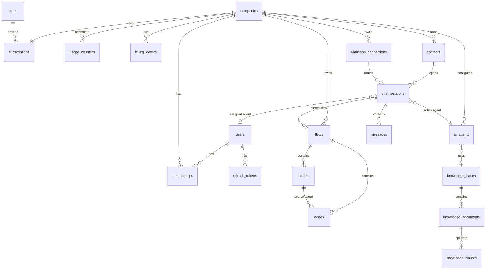
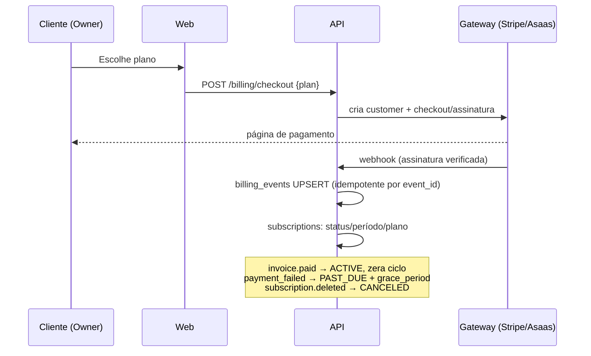

# Zettachat — Arquitetura (Etapa 1)

> Plataforma SaaS de automação e chatbots com IA generativa para WhatsApp, no modelo **Meta Tech Provider**.
> O cliente conecta a própria WABA via **Embedded Signup** e paga as conversas **direto à Meta**.
> Nós cobramos apenas a **licença do software** e controlamos os **limites de IA**. Com isso, não carregamos risco de inadimplência sobre o tráfego de mensagens.

---

## 1. Monorepo (Turborepo + pnpm)

```
zettachat/
├── apps/
│   ├── api/                      # FastAPI (Python, gerenciado por uv, orquestrado via package.json)
│   │   ├── app/
│   │   │   ├── core/             # config, security (JWT/Argon2/Fernet), exceptions
│   │   │   ├── db/               # Base declarativa, engine async, sessão
│   │   │   ├── models/           # SQLAlchemy 2.0 (Mapped / mapped_column)
│   │   │   ├── schemas/          # Pydantic v2 (entrada/saída da API)
│   │   │   ├── services/         # regras de negócio (sem FastAPI)
│   │   │   ├── api/              # deps (auth/tenant/RBAC) + routers v1
│   │   │   ├── integrations/     # [P2] meta/ (Cloud API, Graph), billing/ (Stripe, Asaas)
│   │   │   ├── agents/           # [P3] engine, registry de skills, MCP client, memória
│   │   │   ├── workers/          # [P2/P3] consumidores de fila (webhooks, ingestão RAG)
│   │   │   └── scripts/          # seed, export_openapi
│   │   ├── alembic/              # migrations async
│   │   └── tests/                # pytest + Postgres real
│   └── web/                      # Next.js 16 (App Router) + Tailwind + shadcn/ui [P4]
├── packages/
│   ├── api-client/               # tipos TS gerados do OpenAPI + client openapi-fetch
│   ├── typescript-config/        # tsconfig base/nextjs/library
│   └── ui/                       # [P4] design system compartilhado (shadcn customizado)
├── infra/postgres/init.sql       # extensões: vector, citext, pg_trgm
├── docker-compose.yml            # Postgres 17 + pgvector, Redis 7
├── turbo.json                    # pipeline: openapi → generate → typecheck/build/dev
└── pnpm-workspace.yaml
```

**Como o Python entra num monorepo JS.** O `apps/api` tem um `package.json` cujos scripts delegam ao `uv` (`uv run uvicorn…`, `uv run pytest`…). Para o Turborepo ele é um workspace comum: participa de `dev`, `test`, `lint` e `typecheck` com cache e paralelismo.

**Contrato único FastAPI → TypeScript.** A task `api#openapi` exporta o schema sem subir servidor, e `api-client#generate` gera `schema.d.ts`. O `dev`, o `build` e o `typecheck` do web dependem de `^generate`. Se alguém quebrar o contrato no backend, o typecheck do frontend falha.

---

## 2. Agentes de IA

A arquitetura é **multiagente com roteador**. Cada tenant configura personas (`ai_agents`) sobre um mesmo motor.

| Agente | Papel | Skills típicas |
|---|---|---|
| **Router / Triagem** | Classifica a intenção da mensagem e escolhe o agente especialista ou o fluxo. Barato e rápido (modelo pequeno). | `intent.classify`, `session.get_context` |
| **Comercial (Sales)** | Qualifica o lead (BANT), apresenta produtos, contorna objeções, gera link de pagamento/proposta. | `rag.search`, `catalog.search`, `contact.update_attributes`, `crm.create_deal`, `payment.create_link` |
| **Suporte / FAQ** | Responde com base na base de conhecimento do cliente, com citações. Não inventa. | `rag.search`, `order.lookup`, `ticket.create` |
| **Agendamento** | Consulta disponibilidade, reserva, remarca e cancela. | `calendar.availability`, `calendar.book`, `calendar.cancel` |
| **Qualificador** | Coleta dados estruturados (slots) e grava em `contacts.attributes`. | `contact.update_attributes`, `contact.add_tag` |
| **Supervisor (guardrail)** | Checagem pós-geração: PII, tom, alucinação vs. contexto do RAG e gatilhos de transbordo. | `handoff.request`, `moderation.check` |

**Transbordo para humano** (`handoff.request`) pode ser disparado por:
- pedido explícito do contato ("falar com atendente");
- sentimento negativo persistente;
- baixa confiança (sem trechos relevantes no RAG);
- N turnos sem resolução;
- palavras-chave de risco (jurídico, cancelamento);
- cota de IA esgotada.

O efeito é: `chat_sessions.mode = human`, `status = pending`, `ai_paused_until` definido e a conversa entra na fila do Live Chat.

---

## 3. MCPs e Skills

**Skills** são ferramentas internas: funções Python tipadas, registradas num `ToolRegistry`, com schema JSON gerado do Pydantic e sempre executadas no escopo do tenant (`company_id` injetado pelo engine, **nunca** pelo LLM).

**MCP (Model Context Protocol)** é a camada de integrações externas e plugáveis. Cada tenant pode habilitar servidores MCP, e o engine age como **MCP client**, expondo as tools remotas ao agente com allowlist por agente.

| Servidor / grupo | Tipo | Tools |
|---|---|---|
| `zettachat-knowledge` | Skill interna (MCP-compatível) | `rag.search(query, k, filters)` com busca híbrida pgvector (cosine, HNSW) + full-text e re-rank; `rag.get_document` |
| `zettachat-whatsapp` | Skill interna sobre a Cloud API | `wa.send_text`, `wa.send_media`, `wa.send_interactive` (botões/lista), `wa.send_template` (fora da janela de 24h), `wa.mark_read`, `wa.typing` |
| `zettachat-crm` | Skill interna | `contact.get`, `contact.update_attributes`, `contact.add_tag`, `session.get_history`, `session.summarize` |
| `zettachat-flow` | Skill interna | `flow.trigger(flow_id)`, `flow.set_variable`: permite que a IA "devolva" a conversa a um fluxo determinístico |
| `handoff` | Skill interna | `handoff.request(reason)`, `handoff.assign(user_id)` |
| Google Calendar / Cal.com | MCP externo | `calendar.availability`, `calendar.book`, `calendar.cancel` |
| Stripe / Mercado Pago / Asaas (do cliente) | MCP externo | `payment.create_link`, `order.lookup` |
| HubSpot / Pipedrive / RD Station | MCP externo | `crm.create_deal`, `crm.update_stage` |
| HTTP genérico | MCP externo | `http.request` para webhooks configurados pelo cliente (com allowlist de domínios) |

**Segurança.** Credenciais de MCP ficam criptografadas por tenant. Cada chamada é auditada em `tool_calls` [P3], com timeout, retries e *circuit breaker*. O resultado de uma tool é tratado como **dado, nunca como instrução**, para mitigar prompt injection.

---

## 4. Modelagem lógica (PostgreSQL multi-tenant)

A estratégia é um **banco compartilhado com `company_id` em toda tabela de domínio**, inclusive nas filhas: fica indexado, dispensa JOIN para escopo e já prepara o terreno para **Row-Level Security**. O acesso é resolvido pelo header `X-Company-ID` e validado contra `memberships`.



| Tabela | Pontos-chave |
|---|---|
| `users` | e-mail `CITEXT` único, hash Argon2, `is_superuser` para o backoffice |
| `companies` | o tenant; `slug` único, `timezone`, `settings` JSONB (horário comercial etc.) |
| `memberships` | N:N user↔company com `role` (owner/admin/agent/viewer); `max_concurrent_chats` e `is_online` para o roteamento do Live Chat |
| `refresh_tokens` | persistidos por `jti`: rotação, logout e detecção de reuso |
| `plans` / `subscriptions` / `usage_counters` / `billing_events` | licença e limites; contador mensal com UPSERT atômico; webhooks idempotentes |
| `whatsapp_connections` | `phone_number_id` único (roteia webhook → tenant); `access_token` **criptografado com Fernet** |
| `contacts` | `(company_id, wa_id)` único; `tags`, `attributes` JSONB; `ai_profile_summary` (memória longa) |
| `flows` / `nodes` / `edges` | rascunho editável (nodes/edges com `client_id` do React Flow) e `published_graph` imutável executado pelo runtime |
| `ai_agents` / `knowledge_*` | personas, skills habilitadas e regras de handoff; chunks com `vector(1536)` e índice **HNSW** |
| `chat_sessions` | estado da conversa: `mode` flow/ai/human, nó atual, `context` (memória curta), `summary`, `last_inbound_at` (janela de 24h); índice único parcial garante **1 sessão aberta por contato+número** |
| `messages` | `wa_message_id` único (idempotência de webhook), `status` sent/delivered/read/failed, tokens de IA por mensagem |

Os enums são gravados como `VARCHAR` validado pela aplicação (StrEnum): adicionar um valor novo não exige migration.

---

## 5. Interface (Next.js + Tailwind + shadcn/ui)

**Linguagem visual (estilo Vercel/Linear):**
- neutros frios, alto contraste e **dark mode como cidadão de primeira classe** (tokens CSS em OKLCH, `next-themes`);
- bordas de 1px em vez de sombras;
- tipografia Geist Sans / Geist Mono;
- densidade alta, **Command Palette (⌘K)** para tudo e micro-animações discretas com `motion`.

| Área | Composição |
|---|---|
| **Shell** | Sidebar colapsável (ícones Lucide) com seletor de workspace/tenant no topo, breadcrumbs e ⌘K |
| **Dashboard** | KPIs em cards (conversas, taxa de resolução pela IA, tempo de 1ª resposta, handoffs, consumo de IA vs. limite); gráficos Recharts (área de volume por dia, barras por agente, funil do fluxo); DataTable com TanStack Table |
| **Flow Builder** | Canvas em **React Flow / XYFlow** com grid de pontos, minimapa e controles. Paleta de nós arrastáveis à esquerda. **Shadcn `Sheet`** lateral para editar o nó selecionado (form com react-hook-form + zod). Autosave com debounce, undo/redo (zustand + zundo), validação visual (nós órfãos) e botão *Publicar* que gera o snapshot |
| **Live Chat (3 colunas)** | (1) inbox com filtros (Minhas / Não atribuídas / IA / Fechadas), busca e badges de não lidas; (2) conversa com bolhas, status ✓✓, respostas rápidas (`/`), banner "IA pausada · Retomar IA" e indicador da janela de 24h (fora dela, só template); (3) painel do contato com atributos, tags, sessões anteriores, resumo da IA e ações (atribuir, fechar, disparar fluxo). Atualização em tempo real via WebSocket |
| **Agentes & Conhecimento** | CRUD de personas, playground de teste (chat lateral), upload de documentos com status de indexação |
| **Configurações** | WhatsApp (botão Embedded Signup + status/qualidade do número), equipe, plano e uso, API keys |

---

## 6. Billing (Stripe / Asaas) via webhooks

A camada de gateway é abstrata (`BillingProvider`): **Stripe** para cartão internacional e **Asaas** para Pix, boleto e cartão BR.



**Controle de limites de IA:**
1. Antes de cada chamada ao LLM, `usage_service.ensure_ai_quota()` verifica se a assinatura está utilizável (trial/ativa, ou past_due dentro da carência) e se `usage_counters` do mês está abaixo de `plan.ai_requests_per_month + bonus`.
2. Depois da chamada, `record_ai_usage()` faz o incremento **atômico** (`INSERT … ON CONFLICT DO UPDATE`) de requests e tokens.
3. Alertas em 80% e 100% (e-mail + banner). Ao estourar, a IA pausa e as conversas vão para humano; **fluxos determinísticos continuam funcionando**.
4. Upsell: pacotes avulsos incrementam `bonus_ai_requests`, sem trocar de plano.

Os limites de recursos (conexões, membros, fluxos e documentos) são checados nos endpoints de criação.
